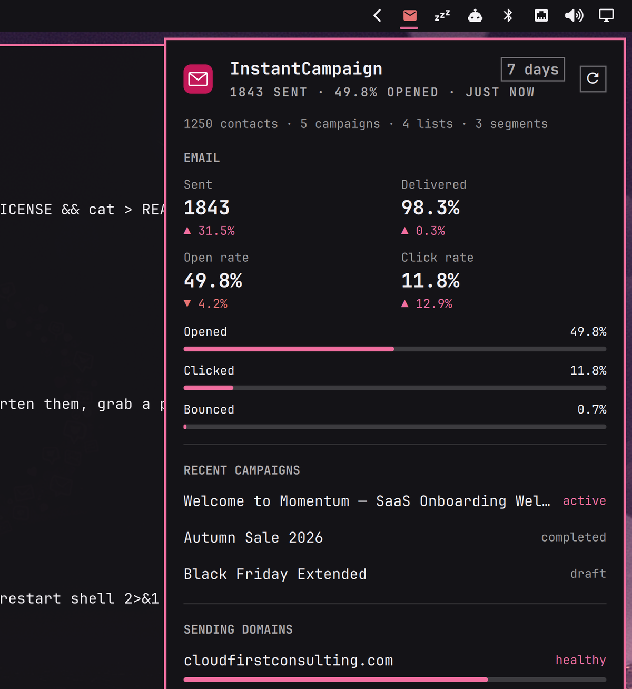

# InstantCampaign Spark for Omarchy

Your [InstantCampaign](https://instantcampaign.ai) workspace in the Omarchy bar:
one envelope that lights up when a sending domain needs attention, and a panel
with the last week's email and website numbers.



## What it shows

- **Email** — sent, delivered, open and click rates for the period, each with
  its change against the period before, plus meters for opened, clicked and
  bounced.
- **Recent campaigns** — the five newest, with their status.
- **Sending domains** — verification, DNS drift, warm-up progress against
  today's cap, blocklist listings and the reputation verdict. A domain that
  needs a hand turns the bar icon to the alert colour and says why.
- **Website** — visitors, sessions, pageviews and bounce rate from the
  cookieless tracking snippet, the live visitor count, and the top pages.

Keys while the panel is open: `r` refresh, `o` open analytics, `c` campaigns,
`d` deliverability, `Esc` close. Right-click the bar icon to open the app,
middle-click to refresh.

## Install

```sh
omarchy plugin add https://github.com/Cloud-First-Consulting/omarchy-instantcampaign-spark --enable
```

Then connect it to your workspace. In InstantCampaign go to **Settings →
API keys**, create a key with the **mcp** scope, and run:

```sh
~/.config/omarchy/plugins/instantcampaign.spark/bin/omarchy-instantcampaign-spark setup
```

The panel's "Set up in a terminal" button does the same. Setup asks for the key
once, stores it in `~/.config/instantcampaign/api-key` with mode 600, and
tests it. The widget refreshes every five minutes; change the interval, the
period (7, 30 or 90 days) or the URL of a self-hosted InstantCampaign in the
widget's settings in the Omarchy shell.

## Remove

```sh
omarchy plugin remove instantcampaign.spark
rm -rf ~/.config/instantcampaign ~/.local/state/omarchy/instantcampaign
```

The second line deletes the stored API key and the cached numbers. Revoke the
key in InstantCampaign as well if you no longer need it.

## How it works, and what it can see

A small bash collector (`bin/omarchy-instantcampaign-spark`) calls four tools
on the InstantCampaign MCP endpoint — workspace overview, email analytics,
deliverability status and web analytics — and writes one JSON file under
`~/.local/state/omarchy/instantcampaign/`. The QML panel only reads that
file. The key is passed to `curl` through its config on stdin, so it never
appears on a command line.

Everything the widget receives is aggregate: counts, rates, campaign names and
domain names. The InstantCampaign API never returns contact data to an API
client, and the tools used here are read-only; nothing in this plugin can send
mail or change your workspace.

Dependencies: `curl`, `jq` (both ship with Omarchy) and `gum` for the setup
prompt (optional; a plain prompt is used without it).

## License

MIT — see [LICENSE](LICENSE). By [Cloud First Consulting](https://github.com/Cloud-First-Consulting),
the company behind InstantCampaign.
